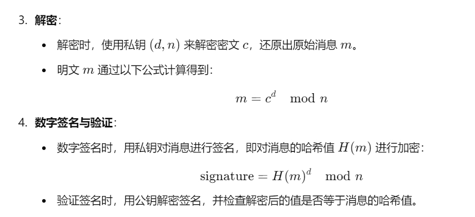

一、作业1：
代码解释：
在 Python 中，使用标准库中的 hashlib 包可以非常方便地实现 SHA-256 哈希加密。hashlib 提供了多种哈希算法，包括 MD5、SHA-1、SHA-256 等。
1、创建 SHA-256 对象：使用 hashlib.sha256() 方法创建一个 SHA-256 哈希对象。
2、更新哈希对象：将需要加密的数据以字节形式传入哈希对象。
3、获取哈希值：通过 hexdigest() 方法获取最终的哈希值，结果是一个十六进制的字符串。

二、作业2：

1、非对称加密解析：

      非对称加密（Asymmetric Encryption）是一种加密算法，它使用一对密钥来进行加密和解密：一个是公钥（Public Key），另一个是私钥（Private Key）。公钥和私钥是成对的，加密与解密过程通过这对密钥完成，但这两个密钥具有不同的用途，且无法相互替代。
      非对称加密的工作原理
      公钥加密，私钥解密：
      公钥可以公开，用来加密消息。任何人都可以使用接收方的公钥来加密消息。
      加密后的消息只能通过私钥解密，而私钥只有接收方自己持有，因此即使公钥是公开的，也不会危害消息的安全性。
      私钥签名，公钥验证：
      私钥还可以用来对消息进行数字签名，表明该消息是由私钥持有者生成的。
      公钥可以验证签名的有效性，确保消息未被篡改，并确认消息来自私钥的持有者。
      非对称加密的核心特性
      公钥和私钥是一对密钥：通过复杂的数学算法生成，公钥负责加密，私钥负责解密。公钥不能用来推算私钥，私钥也不能用来推算公钥。
      保密性：加密过程中使用公钥，私钥持有者可以解密消息。只有拥有私钥的人能解密加密信息，从而保证了保密性。
      认证和完整性：通过私钥对消息签名，公钥持有者可以验证签名，确保消息来源的合法性，防止信息在传输过程中被篡改。
      常见的非对称加密算法
      RSA：最著名和广泛使用的非对称加密算法之一，适合加密小数据量以及数字签名。
      ECC（椭圆曲线加密）：相比 RSA 提供了更高的安全性，密钥长度可以更短，计算性能更高，适合资源受限的环境。
      DSA（数字签名算法）：专门用于生成和验证数字签名。
      ElGamal：另一种基于离散对数问题的非对称加密算法，适合加密较大数据。
      非对称加密的应用场景
      安全通信：HTTPS（基于 TLS/SSL）中，非对称加密用于交换对称加密密钥，以建立安全的加密通道。
      数字签名：在电子邮件、文档签名和软件分发中使用，确保数据来源的真实性和完整性。
      加密货币：如比特币使用非对称加密进行交易验证和身份认证。
      身份验证：通过公钥加密进行身份验证，常见于 SSH 认证、数字证书等。
      对比对称加密
      对称加密：只有一个密钥，用于加密和解密，双方必须共享相同的密钥。
      非对称加密：使用公钥和私钥，不需要共享同一密钥，适合公开环境中的安全通信。
      优点与缺点
      优点：
      安全性高：由于私钥不需要与他人共享，只有持有私钥的人能解密消息。
      便于密钥管理：公钥可以公开，便于安全分发，而无需担心泄露问题。
      缺点：
      计算复杂度高：相比对称加密，非对称加密算法的计算开销大，速度较慢。
      数据加密效率低：通常用于加密小数据量或用于加密对称密钥，然后再通过对称加密处理大量数据。
      总结：
      非对称加密是一种使用公钥和私钥进行加密解密的加密方式，解决了对称加密中密钥分发的问题，并广泛用于安全通信、数字签名和身份验证等场景。

2、RSA算法

      
3、非对称加密实现
        在 Python 中生成公私钥对并进行数字签名和验证，可以使用 cryptography 包。这个包提供了方便的接口来处理公钥加密、签名、验证等任务。我们可以使用 RSA 算法来生成公私钥对，并用私钥对消息进行签名，再用公钥进行验证。
        通过 cryptography 包生成 RSA 公私钥对。
        生成公私钥对：使用 rsa.generate_private_key() 方法生成 RSA 公私钥对。
        签名：使用私钥对消息 message 进行签名，签名使用了 PSS 填充模式和 SHA-256 哈希算法。
        验证：用公钥通过 verify() 方法来验证签名是否有效。如果验证失败，将抛出 InvalidSignature 异常。
        
        生成 RSA 公私钥对时，public_exponent 和 key_size 是两个重要的参数，它们决定了密钥的特性和安全性。以下是对它们的解释：
        1. public_exponent (公钥指数)
        定义：public_exponent 是 RSA 公钥中的一个常量，用来参与加密和签名过程。它通常是一个大素数，RSA 算法中最常用的两个值是 65537 和 3。
        作用：RSA 算法的核心操作依赖于模幂运算，public_exponent 是其中的指数。它影响公钥的加密或验证过程：
        在加密或验证签名时，消息会被取幂运算：(message^public_exponent) mod n，其中 n 是模数（由私钥生成）。
        在解密或验证签名时，公钥和私钥通过模逆运算来验证签名或还原消息。
        常见值：
        65537 是默认值，因为它在安全性和性能之间有很好的平衡。65537 是一个 Fermat 素数（F4 = 2^16 + 1），具有良好的数学特性，且足够大以避免某些攻击。
        3 在某些情况下会被使用，因为它会使加密/解密速度更快。然而，3 更容易受到某些特定攻击（如消息重放攻击），因此在现代应用中较少使用。
        总结：public_exponent 决定了加密或验证时的幂运算指数，较大值（如 65537）提供更好的安全性，较小值（如 3）可能在某些场景下提高速度但伴随安全风险。
        
        2. key_size (密钥大小)
        定义：key_size 是 RSA 密钥的大小，通常以比特为单位。key_size 决定了模数 n 的大小，n 是两个大素数的乘积（即 n = p * q），是 RSA 加密体系的核心参数。
        作用：
        安全性：key_size 决定了 RSA 密钥的强度。较大的密钥位数能够抵抗更强大的攻击，比如素因数分解攻击。当前常见的 RSA 密钥大小为 2048 位和 3072 位，2048 位通常被认为是安全的，而 1024 位的 RSA 密钥已经被认为是不安全的，因为它们可以被较为现代的攻击方式破解。
        性能：较大的 key_size 提供了更高的安全性，但也增加了加密、解密和签名验证过程中的计算成本。密钥越大，加解密操作的速度就越慢，特别是在私钥操作（如签名或解密）时，影响尤为明显。
        常见值：
        1024 位：较小的密钥，现代情况下已经被认为不再安全，不推荐使用。
        2048 位：当前的最低推荐密钥大小，广泛使用，平衡了安全性和性能。
        3072 位及以上：用于更高安全性需求的场合，适合长期密钥使用的情况下。
        4096 位：安全性非常高，但性能开销较大，通常在极高安全要求的场合使用。
        总结：key_size 决定了 RSA 密钥的长度，较大的密钥提供更高的安全性，但也会增加计算开销。对于大多数现代应用，2048 位 RSA 密钥已足够安全。
        总体总结：
        public_exponent：通常选择 65537 作为公钥指数，兼顾安全性和计算效率。
        key_size：密钥大小影响安全性和性能，2048 位是目前最常用的选择，提供良好的安全性和性能平衡。
        通过合理选择这两个参数，可以确保 RSA 密钥对具有高效且安全的加密和解密性能。

